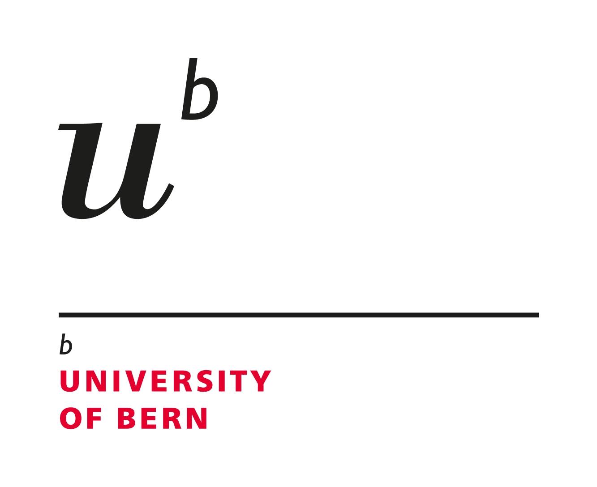

<!-- README.md is generated from README.Rmd. Please edit that file -->

```{r, include = FALSE}
knitr::opts_chunk$set(
  collapse = TRUE,
  comment = "#>",
  fig.path = "man/figures/README-",
  out.width = "100%"
)
```


# `unibeCols` 

<!--  -->


<!-- badges: start -->
<!-- badges: end -->

`unibeCols` contains the corporate design colours of the University of Bern, as defined in the ["Gestaltungselemente" manual](https://intern.unibe.ch/unibe/uniintern/content/e1883/e683686/e695596/e1075264/e1075265/03_UniBE_ManualGestaltungselemente_202112_ger.pdf).

## Installation

<!-- You can install the released version of `unibeCols` from [CRAN](https://CRAN.R-project.org) with: -->

<!-- ``` r -->
<!-- install.packages("unibeCols") -->
<!-- ``` -->

`unibeCols` can be installed from github via

```{r, eval = FALSE}
remotes::install_github("CTU-Bern/unibeCols")
```

or from CTU Bern's universe via

```{r, eval = FALSE}
install.packages("unibeCols", repos = "https://ctu-bern.r-universe.dev")
```


## Example

This is a basic example which shows you how to solve a common problem:

```{r example}
library(unibeCols)
```

All colours can be viewed via 

```{r palettes}
unibePalettes()
```

There are then a set of functions for the darkest colours (e.g. `unibeRed`, `unibeGreen`) and a set of functions for the scale as defined by the names in the plot above (e.g. `unibeRedS`, `unibeGreenS`).

The colours can be used in `ggplot2` or `base` graphics...

```{r base, fig.height = 4}
library(patchwork)
library(ggplot2)
# par(mai = c(.5, .5, .5. .5))
p1 <- ggplot(mtcars, aes(x = disp, y = mpg, col = factor(carb))) + 
  geom_point() + 
  scale_color_manual(values = c(unibeOceanS()[c(1,3,5)], unibeApricotS()[c(5,3,1)]))
p1 + ~plot(mpg ~ disp, mtcars, 
           bg = sample(unibePalettes(FALSE)$cols, nrow(mtcars)), 
           col = NA, pch = 21)
```

... and can also be used to colour text (syntax and result depends on the output format, the following should work for HTML, but not github):

```{r, results='asis'}
cat(paste0('<p style="color:', unibeRed(), '">This should be red</p>'))
```

 

